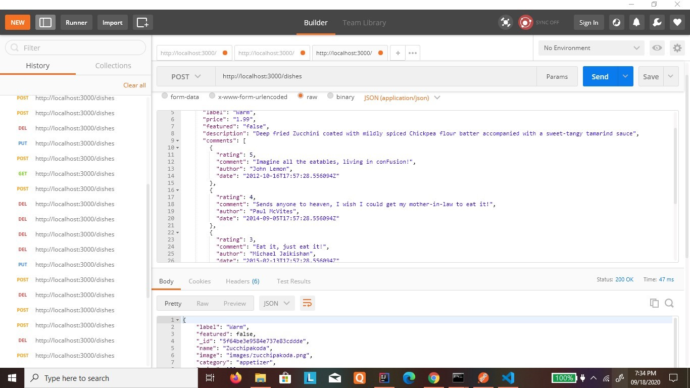
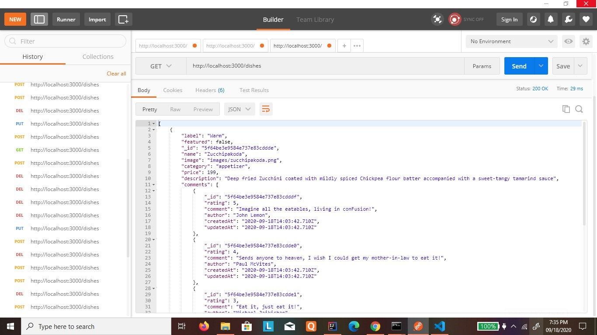
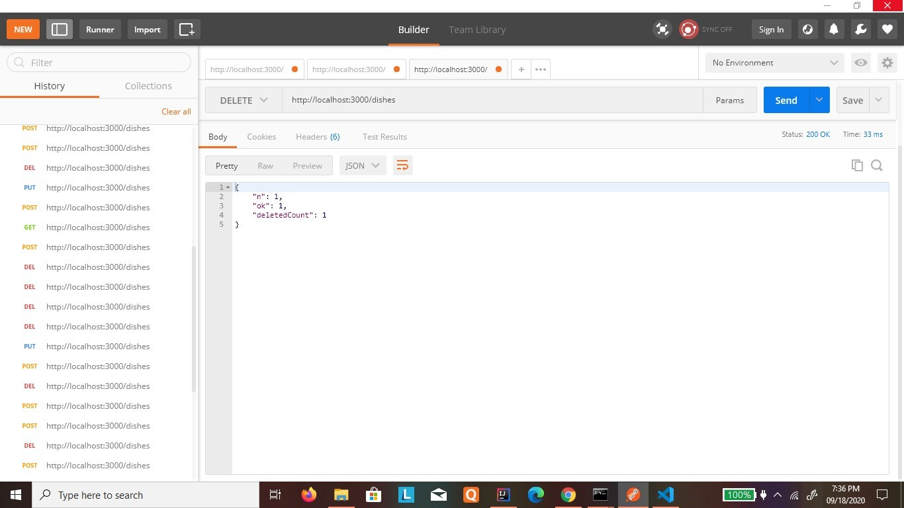
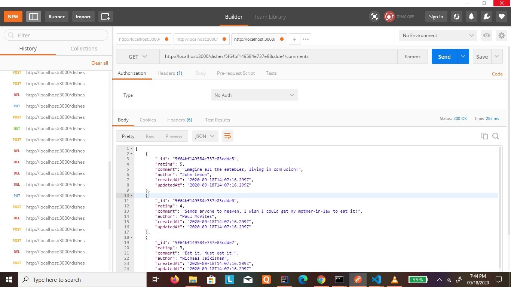
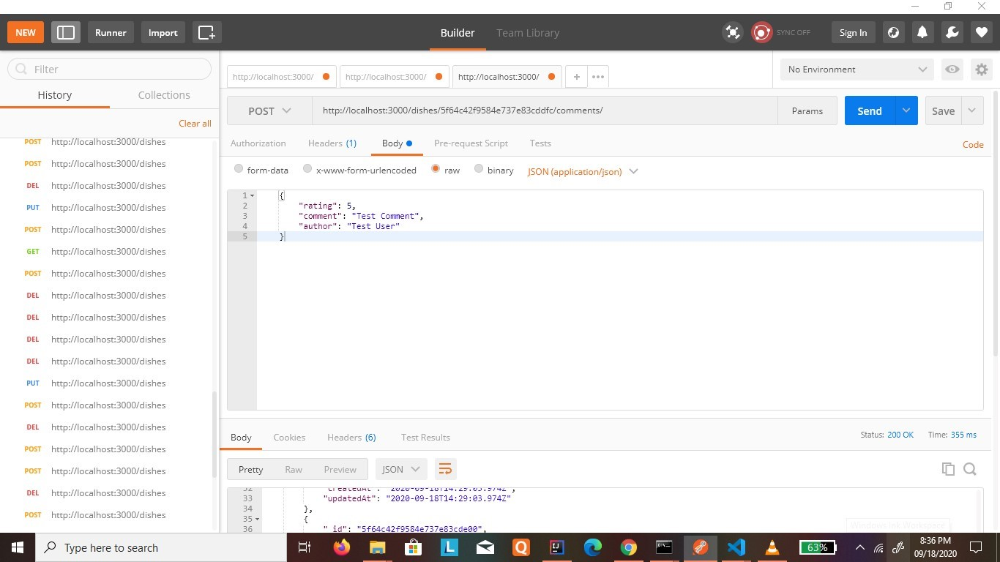
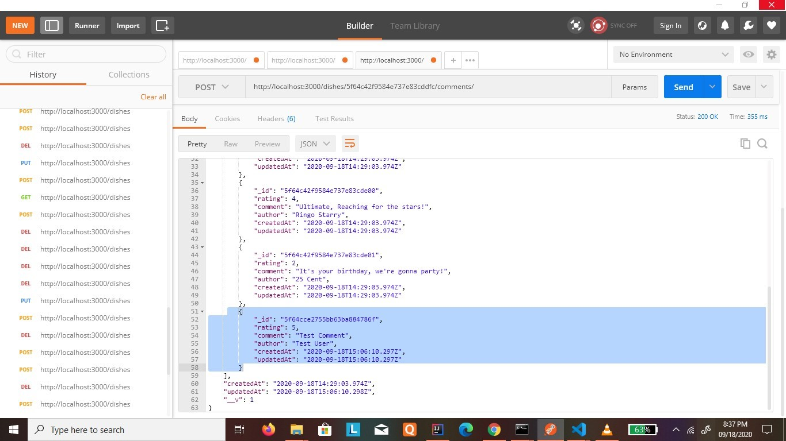
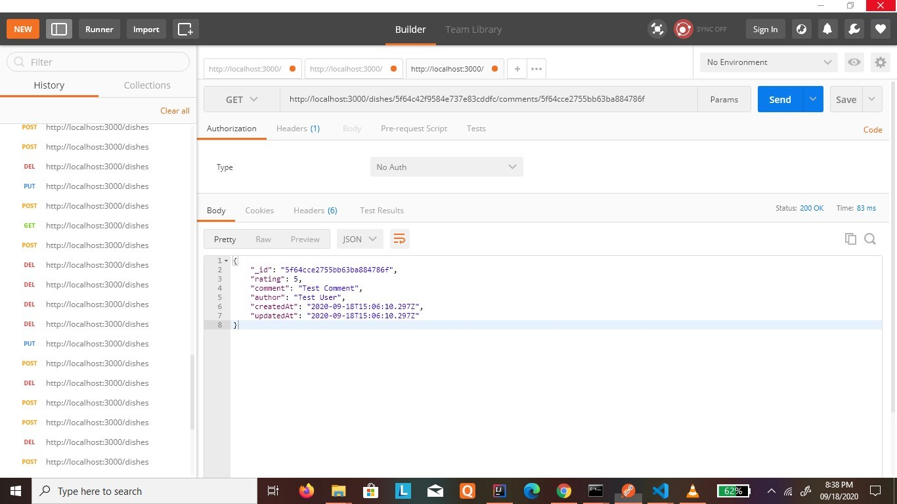
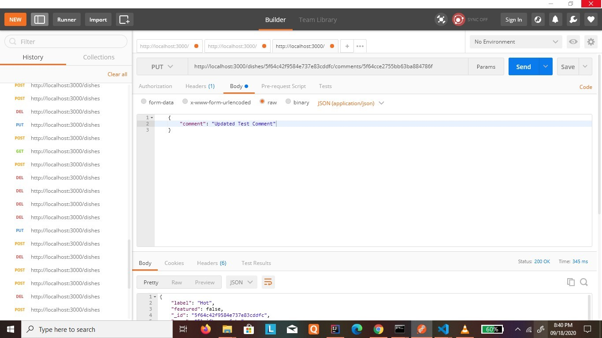
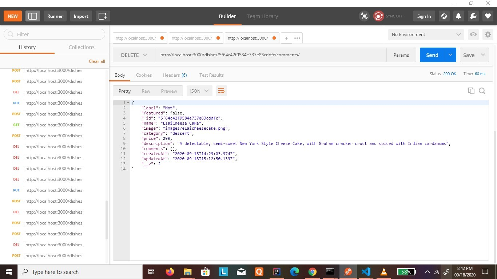

## Dishes_Reviews_For_Foodies!

### About the project
This project contains the API for displaying the dishes placed, creating/placing in a new dish as a feedback with comments, updating a dish or the `dish reviews` in the `comments` subdocument present in the `dishes` document and deleting a particular dish by its `dishId` or all dishes at once.

### Technology Stack
NodeJS with Express is used as framework for the development of the application. 

**Database:** MongoDB

**ODM used:** Mongoose

## Screenshots

1. posting a new review for a dish by POST request

2. getting the posted review by GET request

3. deleting all the comments using DELETE request

4. displaying all comments for a particular dish by its id

5. adding a new comment using POST

6. pic showing that comment is added

7. getting a particular comment by its id using GET

8. updating the previous comment added using PUT

9. pic showing updated commment

10. deleting all the comments using DELETE

